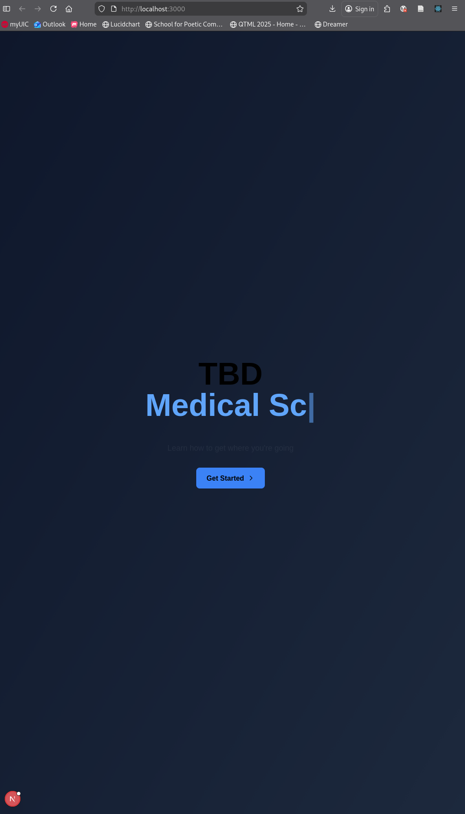

# Web Application Sandbox

A sandbox environment for experimenting with modern web frameworks and technologies. This project provides a foundation for prototyping new ideas and testing out different approaches to web development. Currently it uses React and Next.js for the frontend, and Ollama for LLM integration.

## Tech Stack

**Frontend (`web/`)**
- [Next.js 15](https://nextjs.org/) with Turbopack
- [React 19](https://react.dev/)
- [Tailwind CSS 4](https://tailwindcss.com/)
- [Framer Motion](https://motion.dev/) for animations
- TypeScript

**LLM Integration (`llm/`)**
- Ollama Docker setup with GPU support (NVIDIA & AMD)
- Default model: qwen3:8b

## Getting Started

### Web Application

```bash
cd web
npm install
npm run dev
```

### LLM Service

```bash
cd llm
./run.sh              # Uses default model (qwen3:8b)
./run.sh -m llama3.1  # Specify a different model
```

## Components

The sandbox includes reusable UI components in `web/components/`:
- `modal.tsx` - Modal dialog
- `slide-button.tsx` - Animated slide button
- `textarea.tsx` - Text input area
- `typing-words.tsx` - Typing animation effect

## Current State
